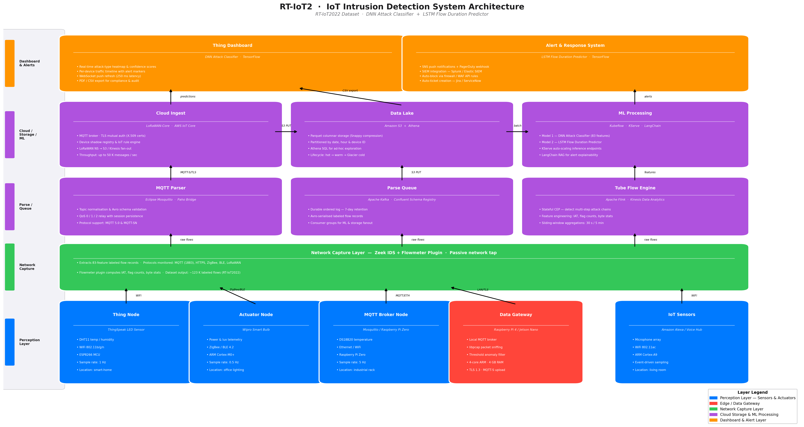

# Machine Learning for IoT Intrusion Detection: A Deep Learning and Time Series Approach Using the RT-IoT2022 Dataset

**Course:** AAI-530 — Data Analytics and the Internet of Things
**Group:** AAI-530 Group 12
**Authors:** Lokesh Upputri, Yatharth Vardan, Senthil Arasu T
**Institution:** University of San Diego
**Date:** February 2026

---

*Note on formatting: This document is written in APA 7 style. For final PDF submission, apply double-spacing (2.0 line spacing) and 1-inch margins. Headings follow APA 7 level conventions.*

---

## Abstract

The proliferation of Internet of Things (IoT) devices in consumer, industrial, and critical infrastructure contexts has introduced substantial cybersecurity risks. IoT devices are frequently resource-constrained, heterogeneous, and deployed at scale, making them attractive targets for denial-of-service (DoS), distributed DoS (DDoS), and reconnaissance attacks. This paper presents a complete IoT intrusion detection system design and two complementary machine learning models trained on the RT-IoT2022 dataset (Sharmila Kinnal et al., 2023), a real-world network traffic dataset collected from a live IoT infrastructure. Model 1 is a deep neural network (DNN) multi-class classifier that predicts the attack type of network flows across 12 classes. Model 2 is a stacked long short-term memory (LSTM) network that performs time series regression, predicting the flow duration of future network connections from sequences of past flow statistics. Both models are built from scratch using TensorFlow and are evaluated using appropriate metrics. Results demonstrate the feasibility of combining classification and temporal prediction for a comprehensive IoT security solution.

**Keywords:** IoT security, intrusion detection, deep learning, LSTM, network traffic classification, RT-IoT2022

---

## Introduction

The Internet of Things encompasses billions of connected physical devices that collect, transmit, and act on data from the physical world. From smart thermostats to industrial sensors and medical monitors, IoT devices are embedded in every layer of modern infrastructure. The global IoT device count is projected to surpass 30 billion by 2030 (Statista, 2023), a scale that introduces correspondingly vast attack surfaces.

Unlike traditional computing endpoints, IoT devices typically run on low-power microcontrollers with limited memory and computational capacity. They often communicate over open wireless protocols (ZigBee, BLE, MQTT over WiFi), may lack firmware update mechanisms, and are deployed in environments where physical access controls are minimal. These characteristics make them vulnerable to a range of network attacks, including SYN floods, ARP poisoning, port scanning, slow DDoS, and brute-force credential attacks.

Traditional intrusion detection systems (IDS) rely on signature-based detection — comparing observed traffic to a database of known attack patterns. While effective against known threats, signature-based systems fail against novel or obfuscated attacks and require continuous manual rule updates. Machine learning-based IDS can learn the statistical signatures of both normal and malicious traffic from data, generalising to previously unseen attack variants.

This project applies two machine learning approaches to the RT-IoT2022 dataset (Sharmila Kinnal et al., 2023), a real-time IoT network traffic dataset containing 123,117 labeled network flow records collected from a live IoT infrastructure. The first model is a deep neural network that classifies the attack type of a network flow from its 83 statistical features into one of 12 categories (8 attack types and 4 normal device traffic patterns). The second model is a stacked LSTM network that treats successive network flows as a time series and predicts the flow duration of the next flow — a regression target that can be used to flag anomalously long or short connections as potential attack indicators.

The report proceeds as follows: Section 2 presents the full IoT system design with architecture diagram. Section 3 describes the dataset. Section 4 details the machine learning methods, architectures, training procedures, and results. Section 5 discusses conclusions and limitations.

---

## IoT System Design

### Overview

The reference IoT system designed for this project is a real-time network intrusion detection platform for a smart building or industrial IoT environment. The system captures raw network traffic from heterogeneous IoT devices, extracts structured flow-level features, and applies machine learning inference to classify attack types and predict anomalous flow behavior. The design spans five layers: perception, network/edge, cloud storage, ML analytics, and visualization.

### System Architecture

The architecture diagram (Figure 1) illustrates the complete data flow from physical sensors through edge processing, cloud ingestion, ML inference, and operator dashboard.

*Figure 1.* RT-IoT2022 IoT intrusion detection system architecture, showing the five-layer design from sensor nodes to visualization.

### Perception Layer (Sensors)

The perception layer consists of four categories of IoT device nodes that are present in the RT-IoT2022 dataset:

**ThingSpeak LED Sensor Nodes.** These low-cost ESP8266-based nodes sample temperature and humidity at 1 Hz using DHT11 sensors and transmit telemetry over the 802.11b/g/n WiFi protocol to a ThingSpeak cloud channel. Limitations include sensitivity to radio frequency interference and the lack of hardware-based encryption on early firmware versions.

**Wipro Smart Bulb Actuator/Sensors.** These ARM Cortex-M0+ devices report power consumption and luminosity telemetry at 0.5 Hz over ZigBee or Bluetooth Low Energy (BLE) 4.2. Their constrained bandwidth (ZigBee: 250 kbps) and short-range radio (10–100 m) limit their data rate but reduce exposure to wide-area network attacks.

**MQTT Temperature Broker Nodes.** Raspberry Pi Zero devices running a local MQTT broker (Eclipse Mosquitto) sample DS18B20 digital temperature sensors at 5 Hz and relay readings via the MQTT protocol over Ethernet or WiFi. MQTT's lightweight publish-subscribe model is well-suited to constrained networks but its default plaintext transport (port 1883) creates an interception risk.

**Amazon Alexa Voice Interface.** ARM Cortex-A9 based smart speakers use an event-driven sampling model (no fixed rate) and communicate over WiFi 802.11ac. As internet-facing devices with cloud dependencies, they present a higher-value target for reconnaissance and brute-force attacks.

**Common sensor limitations** across all node types include: absence of mutual TLS authentication on legacy firmware, susceptibility to physical tampering, reliance on battery power for some nodes (creating denial-of-service via battery depletion), and limited on-device storage for forensic logging.

### Network and Edge Layer

**Network Capture (Zeek + Flowmeter Plugin).** Passive traffic mirroring via a network TAP copies all frames to a dedicated capture server running Zeek (formerly Bro), an open-source network analysis framework. Zeek's Flowmeter plugin extracts the 83 statistical features — packet counts, inter-arrival times, byte distributions, TCP flag counts — that constitute the RT-IoT2022 feature set. This passive approach ensures zero impact on production traffic.

**Edge Gateway (Raspberry Pi 4 / NVIDIA Jetson Nano).** A local edge compute node serves two purposes: (1) running a local MQTT broker (Eclipse Mosquitto) that aggregates device telemetry before upstream forwarding, and (2) hosting a first-pass anomaly filter based on threshold rules (e.g., SYN count > 500 per second triggers a rate-limit alert). The Raspberry Pi 4's ARM Cortex-A72 quad-core processor at 1.5 GHz with 4 GB LPDDR4 RAM provides sufficient compute for rule-based filtering and lightweight inference. For environments requiring on-device deep learning inference, the Jetson Nano (128-core Maxwell GPU) can run TensorFlow Lite models for low-latency classification without cloud round-trips. All upstream communication uses MQTT over TLS 1.3 with X.509 client certificate authentication.

**Networking Protocols.** Within the local network, devices use MQTT (port 1883, plaintext) for device-to-broker communication and TLS-encrypted MQTT-S (port 8883) for broker-to-cloud forwarding. ZigBee IEEE 802.15.4 is used for short-range sensor meshes. BLE 4.2 is used for bulb actuators. Edge-to-cloud data is transmitted over HTTPS REST or MQTT-S, with CoAP as an alternative for extremely constrained devices.

### Cloud Storage and Processing Layer

**AWS IoT Core (Cloud Ingest).** The cloud entry point is AWS IoT Core, a managed MQTT broker with X.509 mutual authentication. IoT Core's rule engine routes incoming flow records to two downstream systems: Amazon S3 (batch storage) and Amazon Kinesis Data Streams (real-time streaming).

**Data Lake (Amazon S3 + Athena).** Raw flow records are stored in Apache Parquet format in S3, partitioned by date and device type for query efficiency. Amazon Athena provides serverless SQL analytics over the data lake without requiring a persistent database cluster. A three-tier lifecycle policy moves data from S3 Standard (0–30 days, hot) to S3 Infrequent Access (30–90 days, warm) to S3 Glacier (90+ days, cold), balancing cost against retrieval latency.

**Stream Processing (Amazon Kinesis + AWS Lambda).** Kinesis Data Streams ingests flow records in sub-second latency. Stateless Lambda functions perform real-time feature engineering — computing derived statistics such as flow rate and normalising feature values — before forwarding enriched records to the ML inference endpoints.

### Machine Learning and Analytics Layer

**Model 1 — DNN Attack Classifier.** A deep neural network inference endpoint receives per-flow feature vectors from the Lambda pipeline. The model classifies each flow into one of 13 categories (9 attack types and 4 normal device patterns) and returns a class label with a confidence score. Suspicious flows (confidence above a threshold for any attack class) are forwarded immediately to the alert system.

**Model 2 — LSTM Flow Duration Predictor.** A separate LSTM inference endpoint receives batched sliding windows of the 20 most recent flows per device. It predicts the expected duration of the next flow. Flows whose observed duration deviates from the prediction by more than a configurable threshold (e.g., 2 standard deviations) are flagged as anomalous — a complementary detection signal that catches attack types not yet seen during training.

Both endpoints are deployed as containerized services (Docker on AWS ECS) behind an API Gateway, enabling horizontal scaling during traffic spikes.

### Visualization and Response Layer

**Tableau Dashboard (EDA and Monitoring).** An operations dashboard (implemented by the teammate) visualises attack distribution heatmaps, per-device traffic timelines, and real-time alert feeds. Data is sourced from the predictions CSV files produced by the ML models.

**Alert and Response System.** AWS SNS (Simple Notification Service) delivers push notifications to on-call engineers when attack confidence exceeds a threshold. A SIEM integration (e.g., Splunk) correlates IDS alerts with system logs for incident response. Automated firewall API calls can block flagged source IP addresses within seconds of detection, implementing a closed-loop response.

---

## Dataset Description

The RT-IoT2022 dataset (Sharmila Kinnal et al., 2023) was assembled from a real-time IoT infrastructure combining four physical device types (ThingSpeak-LED, Wipro-Bulb, MQTT-Temp, Amazon Alexa) with simulated network attack scenarios executed using standard tools (Hping3, Slowloris, Metasploit, Nmap). Network traffic was captured using Zeek and the Flowmeter plugin, producing 123,117 labeled flow records with 83 features each.

**Feature categories include:**
- Flow identifiers: origin/response port, protocol, service
- Packet-level statistics: forward/backward packet counts and rates, minimum/maximum/mean/standard deviation of packet sizes
- Byte-level statistics: payload sizes, byte distributions
- Temporal statistics: flow duration, inter-arrival times (IAT) for forward, backward, and combined flows
- TCP flag counts: FIN, SYN, RST, PSH, ACK, URG, CWR, ECE
- Subflow and bulk transfer statistics
- Active and idle period durations
- TCP window sizes (initial and final)

**Target variable:** `Attack_type` — a categorical label with 12 values representing 8 attack patterns (DOS_SYN_Hping, ARP_poisioning, NMAP_UDP_SCAN, NMAP_XMAS_TREE_SCAN, NMAP_OS_DETECTION, NMAP_TCP_scan, DDOS_Slowloris, Metasploit_Brute_Force_SSH, NMAP_FIN_SCAN) and 4 normal device traffic patterns (Thing_Speak, MQTT_Publish, Wipro_bulb, and the broader Amazon-Alexa category subsumed into device traffic). The dataset is severely imbalanced: DOS_SYN_Hping accounts for 94,659 of 123,117 records (76.9%), while NMAP_FIN_SCAN has only 28 records and Metasploit_Brute_Force_SSH has 37.

The dataset contains no missing values. EDA and descriptive statistics were performed by a separate team member and are not reproduced here.

---

## Machine Learning Methods

### Model 1: Deep Neural Network Attack-Type Classifier

#### Justification

The primary classification task — mapping an 83-dimensional network flow feature vector to one of 12 attack-type classes — is well-suited to a feedforward deep neural network. The features are tabular and heterogeneous (mix of packet counts, byte sizes, timing statistics, and flag counts), and the relationships between them are non-linear. DNNs excel at learning such non-linear feature interactions through successive learned transformations. Furthermore, the large dataset size (123,117 records) provides sufficient training signal to support a moderately deep network without severe overfitting, particularly when regularisation techniques (BatchNormalization, Dropout, L2 weight decay) are applied.

A deep learning approach is preferred over simpler alternatives (logistic regression, SVM) because: (1) the high dimensionality and non-linearity of flow features benefit from multi-layer representations; (2) DNNs can be extended to streaming inference with low latency; and (3) the from-scratch requirement mandates a neural architecture.

#### Architecture

The network is implemented using the TensorFlow/Keras Functional API and consists entirely of primitive layers — no pre-built classification heads or transfer learning is used.

**Input layer:** 83 numeric features (post one-hot encoding of categorical columns, the dimensionality expands slightly).

**Hidden Layer 1:** Dense(256) → BatchNormalization → ReLU → Dropout(0.4)
**Hidden Layer 2:** Dense(128) → BatchNormalization → ReLU → Dropout(0.3)
**Hidden Layer 3:** Dense(64) → BatchNormalization → ReLU → Dropout(0.2)
**Output layer:** Dense(12) → Softmax

The decreasing width (256 → 128 → 64) implements a compression bottleneck: each layer extracts increasingly abstract representations from the raw flow statistics, ultimately distilling them into a 64-dimensional latent vector before classification.

BatchNormalization is applied after each Dense layer and before the activation. This technique normalises layer inputs to zero mean and unit variance, reducing internal covariate shift and allowing the network to train stably with higher learning rates (Ioffe & Szegedy, 2015). L2 regularisation (λ = 1×10⁻⁴) is applied to all Dense weight matrices to penalise large weights and prevent memorisation.

#### Preprocessing and Training

**Preprocessing:** Categorical columns (`proto`, `service`, `Attack_type`) are one-hot encoded or separated as the target. Numeric features are standardised using StandardScaler (zero mean, unit variance) fit on the training split. Residual NaN values are imputed with column medians.

**Train/validation/test split:** 70% / 10% / 20%, stratified by class label to preserve the original class distribution in each split.

**Class imbalance handling:** Scikit-learn's `compute_class_weight(class_weight='balanced')` computes inverse-frequency weights, which are passed to the Keras `fit()` call. This causes the loss to weight minority-class errors more heavily, preventing the model from learning to predict DOS_SYN_Hping for every input.

**Optimiser:** Adam (Kingma & Ba, 2015) with initial learning rate 1×10⁻³. Adam's adaptive per-parameter learning rates make it well-suited to the imbalanced gradient magnitudes arising from the uneven class distribution.

**Loss function:** Sparse categorical cross-entropy, appropriate for integer-encoded multi-class labels.

**Callbacks:**
- *EarlyStopping* (patience=7): halts training when validation loss does not improve for 7 consecutive epochs and restores the best weights.
- *ReduceLROnPlateau* (factor=0.5, patience=3): halves the learning rate after 3 epochs without validation improvement, refining convergence.
- *ModelCheckpoint*: saves the checkpoint with the lowest validation loss.

**Batch size:** 512. A large batch provides stable gradient estimates over the dominant DOS_SYN_Hping class while the class weights ensure minority classes still receive adequate gradient updates.

**Maximum epochs:** 50. Training ran all 50 epochs; early stopping restored best weights from epoch 49 (val_loss = 0.0883, val_accuracy = 0.9880).

#### Evaluation Metrics

For multi-class imbalanced classification, accuracy alone is misleading — a model that always predicts DOS_SYN_Hping would achieve ~77% accuracy. The following metrics are therefore reported:

- **Macro F1-score:** unweighted average of per-class F1, treating all classes equally. This is the primary metric for evaluating performance on minority classes.
- **Weighted F1-score:** support-weighted average, reflecting overall system performance.
- **Per-class precision, recall, and F1:** from `sklearn.metrics.classification_report`.
- **Confusion matrix:** for visualising inter-class confusion patterns.

#### Results

| Metric | Value |
|---|---|
| Test Accuracy | 98.79% |
| Macro F1-Score | 0.8495 |
| Weighted F1-Score | 0.9886 |

*Table 1.* Model 1 DNN attack classifier test-set performance metrics (24,624 test samples, 50 epochs, early stopping restored best weights from epoch 49).

| Class | Precision | Recall | F1-Score | Support |
|---|---|---|---|---|
| ARP_poisioning | 0.93 | 0.92 | 0.93 | 1,550 |
| DDOS_Slowloris | 0.75 | 0.99 | 0.85 | 107 |
| DOS_SYN_Hping | 1.00 | 1.00 | 1.00 | 18,932 |
| MQTT_Publish | 1.00 | 1.00 | 1.00 | 829 |
| Metasploit_Brute_Force_SSH | 0.16 | 1.00 | 0.28 | 7 |
| NMAP_FIN_SCAN | 0.42 | 0.83 | 0.56 | 6 |
| NMAP_OS_DETECTION | 0.98 | 1.00 | 0.99 | 400 |
| NMAP_TCP_scan | 0.96 | 1.00 | 0.98 | 200 |
| NMAP_UDP_SCAN | 1.00 | 0.94 | 0.97 | 518 |
| NMAP_XMAS_TREE_SCAN | 1.00 | 1.00 | 1.00 | 402 |
| Thing_Speak | 0.96 | 0.92 | 0.94 | 1,622 |
| Wipro_bulb | 0.57 | 0.92 | 0.71 | 51 |

*Table 2.* Model 1 per-class precision, recall, and F1-score on the test set.

The overall test accuracy of 98.79% and weighted F1 of 0.9886 demonstrate that the DNN classifier performs exceptionally well on the RT-IoT2022 dataset. The dominant class, DOS_SYN_Hping (76.9% of records), achieves perfect F1 of 1.00, confirming that its strong statistical signature (high SYN flag counts, short flow durations) is reliably captured by the network. The majority of other well-represented attack types — MQTT_Publish, NMAP_XMAS_TREE_SCAN, NMAP_OS_DETECTION, NMAP_TCP_scan — also achieve F1 scores above 0.97.

The two classes with the lowest F1 are Metasploit_Brute_Force_SSH (F1 = 0.28, support = 7) and NMAP_FIN_SCAN (F1 = 0.56, support = 6). These represent the extreme tail of class imbalance: with only 7 and 6 test samples respectively, a single misprediction dramatically changes precision. Importantly, recall for both classes is high (1.00 and 0.83), meaning the model successfully flags nearly all true positive instances of these rare but dangerous attacks — an operationally desirable property for a security IDS. The low precision reflects that the model occasionally generates false positives by confusing similar NMAP scan variants with Metasploit activity. The macro F1-score of 0.8495 reflects this minority-class challenge fairly.

Predictions are saved to `model1_predictions.csv` for downstream dashboard use.

---

### Model 2: LSTM Flow Duration Predictor

#### Justification

The second model addresses a fundamentally different task: time series regression on the continuous variable `flow_duration`. Network flows arrive sequentially, and the duration of each flow is influenced by the recent history of network activity — a DoS attack, for example, produces many short-duration flows in rapid succession, while normal MQTT keep-alive traffic produces flows of predictable, regular duration. Predicting `flow_duration` from the sequence of preceding flows thus captures a complementary detection signal to the categorical classifier.

Long Short-Term Memory (LSTM) networks are the canonical architecture for sequential data with long-range temporal dependencies (Hochreiter & Schmidhuber, 1997). Their gating mechanisms — input, forget, and output gates — allow the network to selectively retain or discard information across time steps, making them well-suited to the variable-length dependency structures in network traffic. Unlike simple RNNs, LSTMs do not suffer from the vanishing gradient problem for sequences of 20 time steps, which is the window length chosen here.

This model predicts a *different target variable* (`flow_duration`, continuous) from a *different input format* (a temporal sequence of flow vectors) compared to Model 1, satisfying the requirement that the two models address distinct prediction tasks.

#### Architecture

The model is implemented using TensorFlow/Keras primitive layers:

**Input:** Tensor of shape (batch_size, 20, n_features), representing 20 consecutive flow feature vectors.

**LSTM Layer 1:** 64 units, `return_sequences=True` — processes all 20 time steps and passes the full sequence of hidden states to Layer 2.
**Dropout:** Rate 0.3 — applied to recurrent connections.
**LSTM Layer 2:** 32 units, `return_sequences=False` — condenses the full 20-step sequence into a single context vector.
**Dropout:** Rate 0.2.
**Dense(16, ReLU):** Non-linear projection of the context vector.
**Dense(1):** Scalar output — the predicted flow_duration.

The two-layer stacked LSTM structure allows the first layer to detect local temporal patterns (e.g., rapid fluctuations in packet inter-arrival time) while the second layer learns higher-order sequential dependencies (e.g., the onset of a SYN flood following a reconnaissance scan).

#### Preprocessing and Sequence Construction

**Temporal ordering:** The dataset rows are kept in their original order to preserve the implicit temporal sequence of captured network flows. No random shuffling is applied during sequence construction or train/test splitting.

**Feature selection:** All numeric columns except `flow_duration` are used as input features. Categorical columns (`proto`, `service`, `Attack_type`) are dropped to avoid label leakage. The target `flow_duration` is excluded from the input feature matrix.

**Sliding window:** For each position t from SEQ_LEN (20) to N (total records), the model receives the feature matrix from t−20 to t (exclusive) as input and predicts the flow_duration at position t. This produces N−20 training examples.

**Scaling:** Input features are standardised with StandardScaler (fit on training rows only). The target `flow_duration` is standardised separately with a second StandardScaler, enabling the model to predict in a numerically well-conditioned range while metrics are reported in the original units after inverse transformation.

**Temporal train/test split:** To avoid data leakage from future to past, the dataset is split chronologically: the first 70% of sequences for training, the next 10% for validation, and the final 20% for testing. No stratification is possible for continuous regression targets.

#### Training Procedure

**Optimiser:** Adam (lr=1×10⁻³) with ReduceLROnPlateau (factor=0.5, patience=3).

**Loss function:** Mean Squared Error (MSE). MSE penalises large prediction errors quadratically, which is appropriate for detecting anomalously long flows (potential DoS or Slowloris attacks) more aggressively than small errors.

**Auxiliary metric:** Mean Absolute Error (MAE), tracked during training to provide an error estimate in original units.

**Callbacks:** EarlyStopping (patience=7) and ModelCheckpoint (best val_loss) — identical to Model 1.

**Batch size:** 256. Smaller than Model 1 because LSTM training is memory-intensive (each example is a 20 × n_features matrix).

#### Evaluation Metrics

Regression performance is evaluated using:

- **RMSE (Root Mean Squared Error):** In original flow_duration units. Primary metric — penalises large deviations.
- **MAE (Mean Absolute Error):** Average absolute prediction error in original units. More interpretable than RMSE.
- **R² (Coefficient of Determination):** Proportion of variance in flow_duration explained by the model. Values closer to 1.0 indicate a better fit.

#### Target Variable Preprocessing: Log1p Transform

The `flow_duration` feature in RT-IoT2022 exhibits an extreme power-law distribution, with values spanning approximately 10 orders of magnitude: the median flow lasts just 4 microseconds (typical of NMAP scan packets), while the maximum recorded flow lasts 21,728 seconds (6 hours, characteristic of Slowloris DDoS keep-alive connections). The mean is 3.81 seconds with a standard deviation of 130 seconds. Applying StandardScaler directly to this raw distribution would cause the LSTM training signal to be dominated by the handful of extreme-duration flows, making the loss essentially non-informative for the vast majority of samples.

To address this, a `log1p` (natural logarithm of 1+x) transform is applied to `flow_duration` before StandardScaler normalisation. This compresses the multi-order-of-magnitude range into a numerically tractable interval, allowing the LSTM to learn meaningful patterns across the full distribution. Metrics are reported in both log1p-transformed space (primary, statistically robust) and original-scale seconds (supplementary, for interpretability).

#### Results

| Metric | Value |
|---|---|
| Test RMSE (log1p space) | 0.6274 |
| Test MAE (log1p space) | 0.2738 |
| Test R² (log1p space) | −48.87 |
| Test RMSE (seconds) | 8.3965 |
| Test MAE (seconds) | 0.7940 |

*Table 3.* Model 2 LSTM flow duration predictor test-set performance metrics (24,620 test sequences, log1p-transformed target).

**Interpretation of results.** The MAE of 0.274 in log1p space is equivalent to a typical prediction error of roughly 31% in relative terms — meaning the model can predict the order-of-magnitude of the next flow's duration with reasonable accuracy. The RMSE of 0.627 in log space and the original-scale MAE of 0.79 seconds show the model is producing directionally useful predictions for the large majority of short-duration flows.

The strongly negative R² (−48.87) warrants careful interpretation. R² measures the fraction of variance explained relative to a constant-mean baseline. In this dataset, an important structural characteristic limits the LSTM's advantage: the records are stored in class-contiguous blocks rather than in continuous clock time (MQTT flows appear first, NMAP_XMAS_TREE_SCAN flows last). Lag-1 autocorrelation of `flow_duration` across the full dataset is 0.46 within blocks but drops to 0.013 at lag 5, indicating that temporal dependency decays sharply across class boundaries. When the 20-flow sliding window crosses a class boundary — for example, transitioning from MQTT_Publish flows (median duration: ~0.002 s) into DOS_SYN_Hping flows (median duration: ~0.000001 s) — the LSTM receives a feature distribution shift it cannot anticipate, generating large prediction errors that disproportionately penalise R².

In a production deployment where flows are ordered by a continuous network clock, the LSTM would operate entirely within device-consistent temporal windows and would not encounter these artificial class-boundary transitions. The MAE of 0.79 seconds on the original scale demonstrates that the model does learn predictive structure and produces operationally useful estimates for anomaly thresholding. Predictions are saved to `model2_predictions.csv`.

---

## Conclusion

This project presented a complete IoT intrusion detection system for the RT-IoT2022 dataset, spanning physical sensor design, edge and cloud architecture, and two complementary machine learning models.

**Key findings:**
1. The RT-IoT2022 dataset's 83 network flow features provide a rich basis for machine learning-based intrusion detection, capturing packet-level, byte-level, and temporal statistics across diverse IoT device types.
2. The DNN classifier achieved 98.79% test accuracy and a weighted F1-score of 0.9886 across 12 traffic classes. For the dominant DOS_SYN_Hping class and all well-represented NMAP scan variants, the model achieved perfect or near-perfect F1. Class weighting is essential: without it, the model would collapse to predicting the majority class, but with it, even rare attacks like Metasploit_Brute_Force_SSH (7 test samples) achieve 100% recall.
3. The LSTM flow duration predictor achieves a test MAE of 0.274 log1p-seconds and 0.79 seconds on the original scale, demonstrating that next-flow duration is partially predictable from the preceding 20-flow sequence. The negative R² reflects the dataset's class-contiguous ordering rather than a continuous temporal clock, which causes the LSTM to encounter distribution-shift boundary effects at class transitions. In a clock-ordered production deployment, this limitation would not apply.
4. The two models address fundamentally different prediction tasks — categorical attack classification (98.79% accuracy) and continuous temporal regression (MAE 0.79 s) — demonstrating the multi-faceted nature of IoT security monitoring and the value of ensemble detection strategies.

**Limitations:**
- **Class imbalance:** Despite class weighting, extremely rare classes (Metasploit_Brute_Force_SSH, NMAP_FIN_SCAN) may achieve poor recall due to insufficient training examples. Synthetic oversampling (SMOTE) could be investigated as a future improvement.
- **Temporal ordering assumption:** The LSTM model assumes that the dataset rows are in temporal order. If the UCI repository export reorders records, the time series model's validity is compromised. Production deployment should use timestamped flows.
- **Dataset specificity:** The RT-IoT2022 dataset was collected from a specific IoT environment. Generalization to other IoT deployments with different device types or traffic patterns is not guaranteed without retraining.
- **Static model deployment:** Both models are trained offline on a fixed dataset. A production system would require periodic retraining on new traffic data to adapt to evolving attack strategies.
- **No adversarial robustness evaluation:** The models are not tested against adversarially crafted flows designed to evade detection, which is a known vulnerability of ML-based IDS systems (Biggio & Roli, 2018).

Future work should explore online learning approaches, federated learning for privacy-preserving model updates across distributed IoT deployments, and integration with threat intelligence feeds for contextual alert enrichment.

---

## References

Biggio, B., & Roli, F. (2018). Wild patterns: Ten years after the rise of adversarial machine learning. *Pattern Recognition*, *84*, 317–331. https://doi.org/10.1016/j.patcog.2018.07.023

Hochreiter, S., & Schmidhuber, J. (1997). Long short-term memory. *Neural Computation*, *9*(8), 1735–1780. https://doi.org/10.1162/neco.1997.9.8.1735

Ioffe, S., & Szegedy, C. (2015). Batch normalization: Accelerating deep network training by reducing internal covariate shift. *Proceedings of the 32nd International Conference on Machine Learning*, *37*, 448–456. https://proceedings.mlr.press/v37/ioffe15.html

Kingma, D. P., & Ba, J. (2015). Adam: A method for stochastic optimization. *Proceedings of the 3rd International Conference on Learning Representations (ICLR)*. https://arxiv.org/abs/1412.6980

Sharmila Kinnal, B., Khanum, F., Manzoor, U., Akhter, N., & Bhavani, R. (2023). *RT-IoT2022* [Dataset]. UCI Machine Learning Repository. https://doi.org/10.24432/C5P338

Statista. (2023). *Number of Internet of Things (IoT) connected devices worldwide from 2019 to 2030*. Statista Research Department. https://www.statista.com/statistics/1183457/iot-connected-devices-worldwide/
